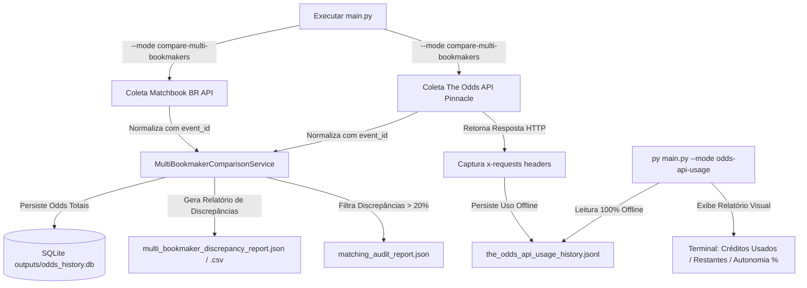

# Resumo do Desenvolvimento do Projeto - Surebet (Gestão Antigravity)

Este documento apresenta um registro detalhado de todas as etapas de desenvolvimento, decisões de arquitetura e correções técnicas realizadas desde que a inteligência artificial **Antigravity** assumiu a continuidade do projeto.

---

## 1. Contexto e Motivação do Pivot

Originalmente, o projeto Surebet foi estruturado para realizar a comparação clássica de odds entre duas bolsas de apostas (**Betfair Exchange** e **Matchbook Brasil**), operando sob um modelo de arbitragem direta de duas pontas (*Back* contra *Lay*) para o esporte Futebol.

No início do nosso ciclo de trabalho, identificamos que a conta da Betfair Exchange estava sob um **lockout temporário de jogo responsável por 30 dias**, o que impossibilitava o fluxo principal de coleta de odds e inviabilizava a busca por surebets no futebol. 

### A Estratégia de Pivotagem:
Para contornar o lockout sem interromper o andamento do projeto, pivotamos a estratégia em direção a um modelo **Multi-Bookmaker**. Substituímos a Betfair temporariamente por uma casa de apostas tradicional de alta eficiência de preços (**Pinnacle**, consultada via **The Odds API**), comparando-a contra a **Matchbook BR**. 
Como a Pinnacle não opera como Exchange (não aceita apostas Lay), o modelo do projeto mudou de "arbitragem clássica" para **rastreamento de discrepâncias e valor relativo de odds** em Moneyline (H2H) para esportes alternativos: **MMA**, **Beisebol (MLB)** e **Basquete (WNBA)**.

---

## 2. Linha do Tempo e Ajustes Técnicos Realizados

### Fase 1: Correção do Endpoint e Descoberta de Bookmakers (Odds API)
* **Problema Encontrado**: O endpoint `/v4/bookmakers` anteriormente utilizado para verificar quais casas estavam disponíveis na API retornava erro `404 Not Found` no plano v4 da The Odds API.
* **Solução**:
  * Removemos o endpoint inexistente.
  * Implementamos um algoritmo de descoberta em `clients/the_odds_api_client.py` que consulta os eventos esportivos ativos da API (`/v4/sports/{sport}/odds`) e mapeia as casas disponíveis examinando a lista dinâmica de `event["bookmakers"]`.
  * Adicionamos o modo `py main.py --mode odds-api-bookmakers`, gerando o arquivo `outputs/the_odds_api_bookmakers.json` e listando de forma amigável no terminal quais das casas desejadas estavam disponíveis na região/plano do usuário. Escopo estratégico atualizado: Betano e Bet365 ficam fora de abertura de conta, ranking, integração, coleta, comparação e priorização por restrição do usuário.

### Fase 2: Comparador Multi-Bookmaker e Proteção de Dados
* **Implementação**: Desenvolvemos o serviço `services/multi_bookmaker_comparison_service.py`.
* **Regras de Pareamento**:
  * Filtra os esportes MMA, Beisebol e Basquete.
  * Realiza o pareamento de eventos aplicando um delta de tempo limite tolerável (`MAX_START_TIME_DELTA_MINUTES`) e distância textual (SequenceMatcher) nos nomes das equipes/lutadores.
  * Compara odds líquidas (pós-comissão do Matchbook BR) e calcula o desvio percentual de preços.
* **Segurança e Proteção de Dados**:
  * Implementamos tratamentos amigáveis para a ausência da chave `THE_ODDS_API_KEY` no arquivo `.env`.
  * Criamos uma proteção contra falhas de API: se a consulta à Pinnacle falhar ou retornar zero registros, a execução é abortada de maneira segura **sem sobrescrever ou corromper relatórios válidos anteriores** com dados vazios.

### Fase 3: Persistência de Histórico SQLite
* **Implementação**: Desenvolvemos o serviço `services/odds_history_service.py` e o integramos ao comparador.
* **Estrutura**: Inicializa e alimenta um banco de dados local SQLite em `outputs/odds_history.db`.
* **Rastreabilidade**: Adicionamos colunas de auditoria fundamentais para análise histórica posterior:
  * `collected_at`: Data/hora exata em que a odd foi coletada (UTC ISO).
  * `event_start_time`: Início oficial do evento.
  * `source_type`: Classificação da fonte (`exchange` ou `odds_feed`).
  * `source_provider`: O provedor da informação (`matchbook-br` ou `the-odds-api`).
  * `bookmaker`: Casa de apostas dona da odd (`pinnacle` ou `matchbook-br`).

### Fase 4: Loop de Monitoramento Contínuo (`watch-multi-bookmakers`)
* **Implementação**: Roteamos e integramos o novo modo CLI:
  ```powershell
  py main.py --mode watch-multi-bookmakers
  ```
* **Ajustes Realizados**:
  * Integramos o loop de repetição contínua respeitando as variáveis de ambiente `WATCH_MULTI_BOOKMAKER_INTERVAL_SECONDS` e `WATCH_MULTI_BOOKMAKER_MAX_CYCLES`.
  * Corrigimos um erro crítico de escopo (`NameError: name 'time' is not defined`), importando localmente `time`, `json`, `datetime` e `timezone` dentro da função correspondente no `main.py`.
  * O loop gera e alimenta o arquivo em formato JSON Lines `outputs/multi_bookmaker_watch_history.jsonl` com estatísticas agregadas por ciclo.

### Fase 5: Auditoria de Consumo da API (`odds-api-usage`)
* **Problema Encontrado**: O plano Starter da The Odds API limita o usuário a **500 créditos por mês**. Cada ciclo de consulta nos 3 esportes consome cerca de **3 créditos** (1 por esporte). Executar um loop de watch contínuo a cada 5 minutos consumiria a cota mensal inteira em menos de 14 horas.
* **Solução**:
  * Modificamos o `TheOddsAPIClient` para ler silenciosamente os headers HTTP `x-requests-remaining` (restantes no mês), `x-requests-used` (consumidos no mês) e `x-requests-last` em cada chamada efetuada (tanto em requisições bem-sucedidas quanto em falhas tratadas na exceção).
  * Gravamos essa auditoria em `outputs/the_odds_api_usage_history.jsonl`.
  * Criamos o comando `py main.py --mode odds-api-usage` que opera de forma **100% offline** (apenas lê o histórico local para não gastar novos créditos da API) e resume o consumo no terminal, exibindo graficamente a autonomia restante e as últimas 5 transações de consumo.
  * Isso permitiu a você planejar coletas seguras e econômicas (ex: rodar ciclos manuais 3x ao dia ou o modo watch de 1 em 1 hora por 6 ciclos).

### Fase 6: Auditoria de Pareamento e Propagação de IDs
* **Problema Encontrado**: O pareamento puramente textual de nomes de lutadores ou equipes pode associar eventos incorretos e gerar falsas discrepâncias gigantescas (>20%).
* **Solução**:
  * **Propagação de `event_id`**: Propagamos o ID único do evento gerado pelas APIs de origem (Matchbook BR e The Odds API) em todas as camadas de normalização do código.
  * **Migração Automática do SQLite**: Atualizamos o `OddsHistoryService` para que, na inicialização do banco, ele verifique a estrutura e adicione a coluna `event_id TEXT` na tabela existente usando `ALTER TABLE`, sem corromper ou perder o histórico de odds antigas.
  * **Relatório de Auditoria de Pareamento**: Lançamos no comparador a criação automática de `outputs/matching_audit_report.json`. Ele filtra e registra especificamente qualquer pareamento cuja discrepância supere **20%**, permitindo-nos caçar e refinar falsos-positivos na similaridade textual.

---

## 3. Estado Atual da Arquitetura Multi-Bookmaker

O fluxo operacional do pivot multi-bookmaker sob controle da cota de consumo é ilustrado a seguir:



O projeto encontra-se em estado maduro, seguro contra consumo indevido de cotas de API e pronto para expansões futuras.
